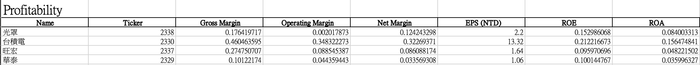
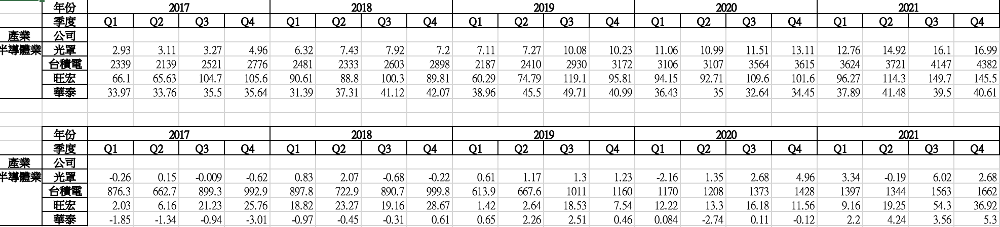
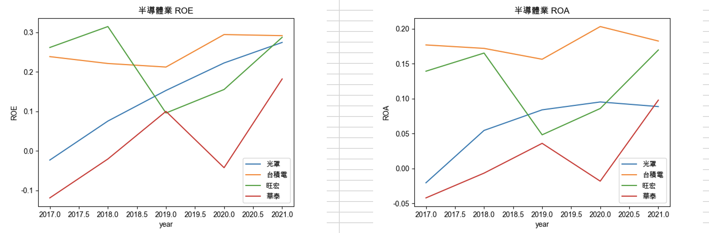

# Financial Analyser

## Purpose

The project is to create financial ratio statement, pivot table, and visualization from from specific companys' finanical data.

The results would be stored in an excel file, and the file would be sent to assigned recipients via email automatically.

## Usage

```
usage: main.py [-h] [-i INDUSTRY] [-c COMPANY [COMPANY ...]] [-y YEAR]
               [-q QUARTER] -e EMAIL

  -i INDUSTRY, --industry
                        industry to filter e.g. "半導體業"
  -c COMPANY [COMPANY ...], --company
                        company's ticker e.g. "2330"
  -y YEAR, --year
                        year (from 2017 to 2021)
  -q QUARTER, --quarter QUARTER
                        quarter e.g. "Q1"
  -e EMAIL, --email EMAIL
                        email address of recipient
```

### Input

`python main.py -c 2329 2330 2337 2338 -e charles.chichun@gmail.com -y 2019 -q "Q1" -i "半導體業"`

### Output

:chart_with_upwards_trend: FA_result.xlsx





## Procedure

1. Parse input's argument
2. Scrape Balance Sheet and Income Statement from https://goodinfo.tw/tw/ website
3. Clean and concat for later analysis
4. Filter by Industry, Year, and Quarter
5. Calculate financial ratios, such as Gross Margin and ROE
6. Create pivot table and visualization
7. Send results to recipient